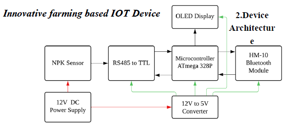
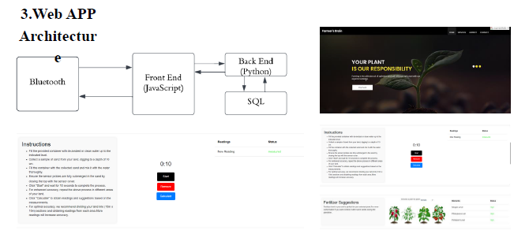
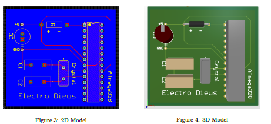

# AI-Driven IoT Fertilizer Advisor for Farmland Optimization

## Overview
The AI-Driven IoT Fertilizer Advisor is an innovative solution designed to advance precision agriculture by delivering real-time, data-driven fertilizer recommendations to optimize farmland productivity. This project integrates IoT sensor technology with a rule-based AI system to provide actionable insights for farmers, bridging real-time land conditions with expert agronomic knowledge.

## Features
- **Real-Time NPK Analysis**: Employs IoT-based sensors to monitor Nitrogen (N), Phosphorus (P), and Potassium (K) levels in farmland soil, ensuring accurate and timely data.
- **AI-Driven Fertilizer Recommendations**: Utilizes a rule-based AI system to analyze sensor data and recommend optimal fertilizer usage tailored to specific land conditions.
- **Multilingual Web Application**: Provides a user-friendly, multilingual interface, enabling farmers worldwide to interact seamlessly with the system.
- **Knowledge-Bridging System**: Connects farmers with expert agronomic advice by integrating real-time data with verified rule sets, supporting informed decision-making.
- **Data Validation**: Ensures reliability by validating AI-generated recommendations against verified agricultural datasets, maintaining high accuracy.
- **Precision Agriculture**: Enhances farmland optimization by enabling data-driven decisions, reducing waste, and improving crop yields sustainably.

## System Architecture
The following diagram illustrates the high-level architecture of the AI-Driven IoT Fertilizer Advisor system, showcasing the integration of IoT sensors, AI processing, and the web application.

## Circuit Schematics
The circuit diagram below details the wiring and connections for the IoT-based NPK sensor device used in the project.

## Usage
1. Deploy the IoT device in the farmland to collect real-time NPK data.
2. Access the web application via a browser to view sensor data and fertilizer recommendations.
3. Use the multilingual interface to interact with the system in your preferred language.
4. Review AI-generated fertilizer suggestions, validated against expert agricultural datasets.
5. Apply the recommended fertilizer quantities to optimize crop growth.

## License
This project is licensed under the MIT License. See the [LICENSE](LICENSE) file for details.

## Contact
For questions or feedback, please contact the project maintainers at mugeshkrish007@gmail.com(mailto:mugeshkrish007@gmail.com).
